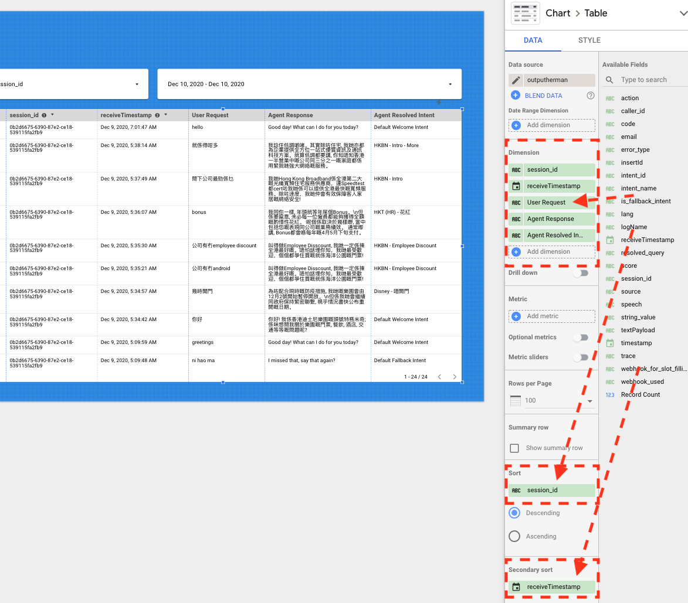
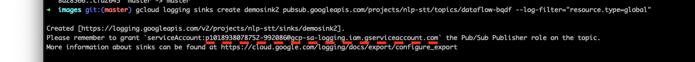
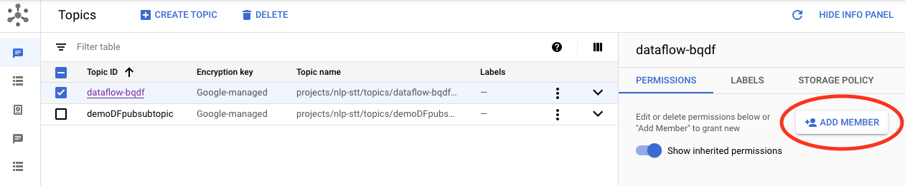
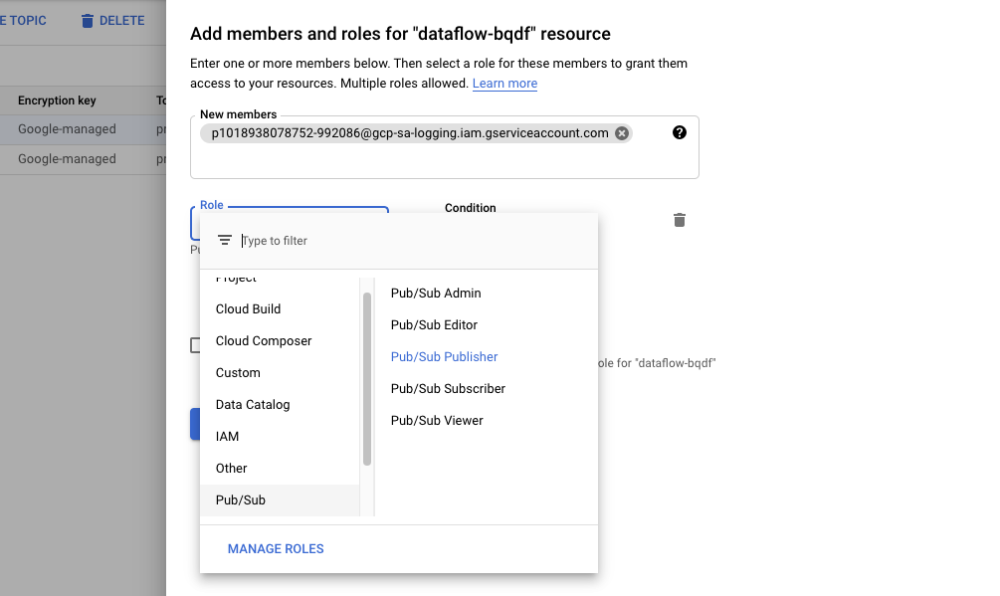

# Dialogflow Conversation Visualizer
This repository contains an example of sending Dialogflow interactions to BigQuery using Dataflow. Using Data Studio to visualize entire conversations, or groups of dialogflow interactions.

## Visualization
You can view Dialogflow complete conversations between End Users and the Agent. This setup guide will show you how to enable searching via Session Id or Timestamp.



## Data Pipeline
The Pipeline Steps are as follows:

1. Dialogflow Interactions are logged to Google Cloud Logging
2. A Cloud Logging sink sends the log messages to Cloud Pub/Sub
3. Dataflow process the __textpayload__ and streams it to BigQuery
4. Access to the log interactions are now available in BigQuery


__Note:__ Dialogflow Interactions Logging is sent to Cloud Logging as a Text Payload, this code will parse the Text Payload to a structured format within BigQuery which is defined in the Dataflow code.

## BigQuery Schema
You can change the schema as required in the Dataflow code to include other key:value pairs extracted from Cloud Logging. Here is a reference to the current schema:

| Field name      | Type | 
| ----------- | ----------- | 
| session_id      | STRING       |
| trace   | STRING        |
| caller_id   | STRING        |
| email   | STRING        |
| timestamp   | TIMESTAMP        |
| receiveTimestamp   | TIMESTAMP        |
| resolved_query   | STRING        |
| string_value   | STRING        |
| speech   | STRING        |
| is_fallback_intent   | STRING        |
| webhook_for_slot_filling_used   | STRING        |
| webhook_used   | STRING        |
| intent_name   | STRING        |
| intent_id   | STRING        |
| action   | STRING        |
| source   | STRING        |
| error_type   | STRING        |
| code   | STRING        |
| insertId   | STRING        |
| logName   | STRING        |
| lang   | STRING        |
| textPayload   | STRING        |

## Installation

1. Enable the Dataflow API
    ```sh
    gcloud services enable dataflow
    ```

2. Create a Storage Bucket for Dataflow Staging

    ```sh
    gsutil mb gs://[BUCKET_NAME]/
    ```

3. Create a folder in the newly created bucket in the Google Cloud Console Storage Browser called __tmp__

4. Create a Pub/Sub Topic
    ```sh
    gcloud pubsub topics create [TOPIC_NAME]
    ``` 
5. Create a Cloud Logging sink
    ```sh
    gcloud logging sinks create [SINK_NAME] pubsub.googleapis.com/projects/[PROJECT_ID]/topics/[TOPIC_NAME] --log-filter="resource.type=global"
    ```
    
    Enable the Google Cloud Logging Sink to write into the Pub/Sub topic that was created in Step 4.
    
    First save the log output containing the service account address. If you did not save it. You can find this in Cloud Logging Router as the `Writer Identity` of the Cloud Logging Sink that you created.
    
    
    Second check the Pub/Sub topic. On the right hand side menu, find `Permissions` and `Add Member`
    
    
    Finally add the service account, also known as the `Writer Identity`, to this Pub/Sub Topic and give them the `Pub/Sub Publisher` role. Click save.
    
    
6. Install the Apache Beam GCP Library
    ```sh
    python3 -m virtualenv tempenv
    source tempenv/bin/activate
    pip install "apache-beam[gcp]"
    ```

7. Create BigQuery dataset

8. Deploy Dataflow Job
    ```sh
    python3 stackdriverdataflowbigquery.py --project=[YOUR_PROJECT_ID] \ 
    --input_topic=projects/[YOUR_PROJECT_ID]/topics/[YOUR_TOPIC_NAME] \ 
    --runner=DataflowRunner --temp_location=gs://[YOUR_DATAFLOW_STAGING_BUCKET]/tmp \
    --output_bigquery=[YOUR_BIGQUERY_DATASET.YOUR BIGQUERY_TABLE] --region=us-central1
    ```

9. Enable Dialogflow Logs to Cloud Logging

    Enable Log interactions to Dialogflow and Google Cloud
    https://cloud.google.com/dialogflow/docs/history#access_all_logs

Once you enable Enable Log interactions, your new Dialogflow interactions will be available in BigQuery


**This is not an officially supported Google product**
